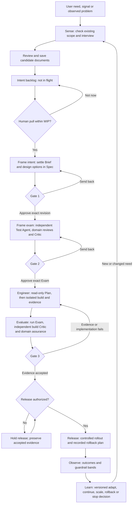
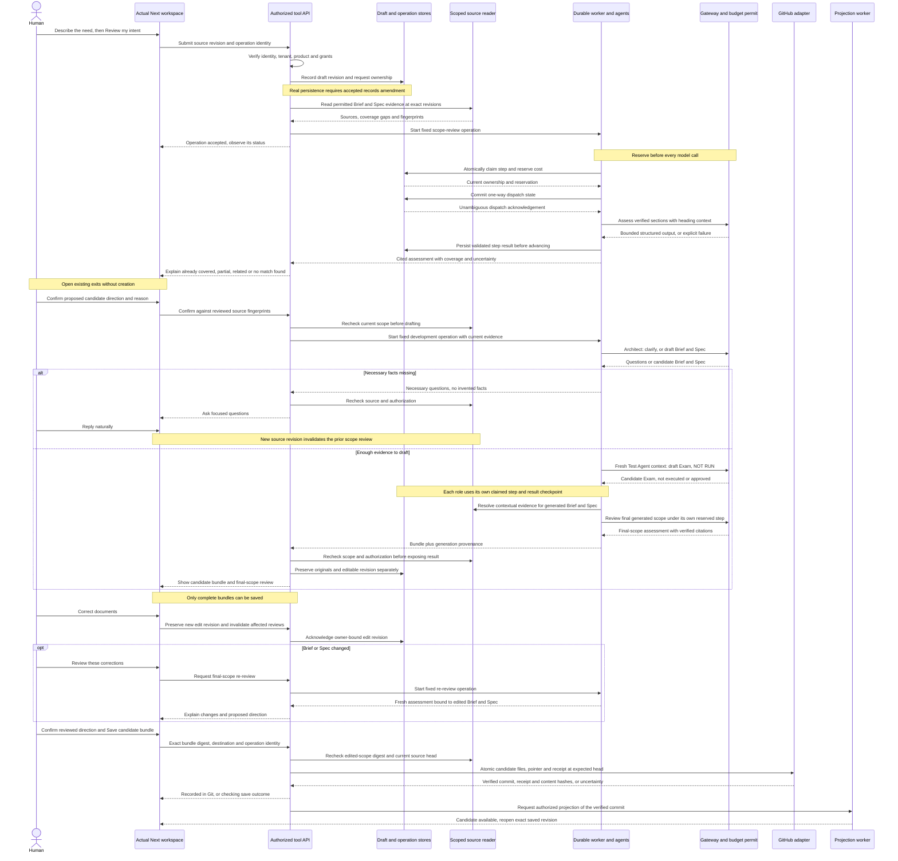
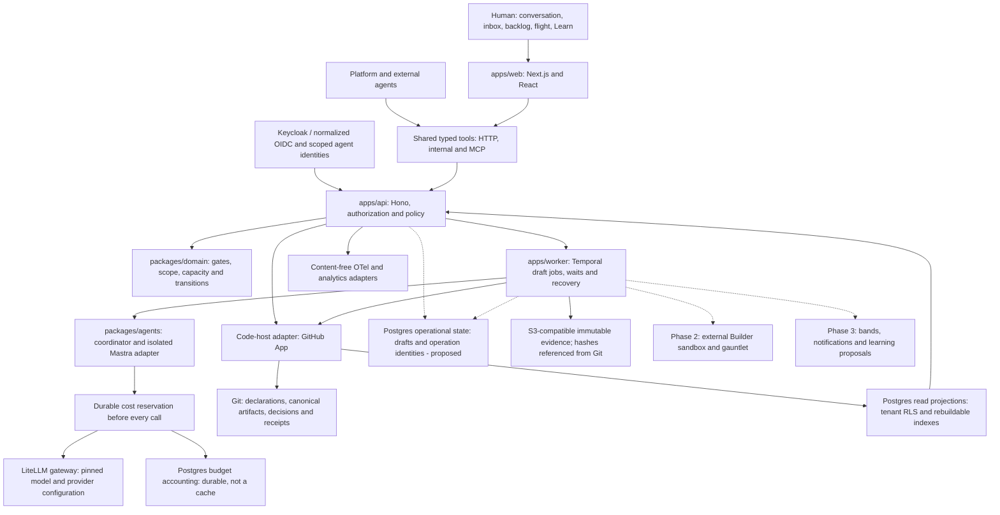

# STEER: end-to-end process, workflow and architecture

Design review package · Revision 2 · 2026-09-07 · Original implementation snapshot: `0f4ee265a51896fbbddaa23063c9933aa4bfba8b`; contract/editor checkpoint: [0205](../../intent/0205/EVIDENCE.md).

Start here to understand **what happens, when it happens, who owns it, and what
must be recorded before the next step**. These are target flows, not a claim that
the whole application is connected. The [status table](#5-what-is-actually-ready)
separates tested components from a demonstrated live journey.

This package preserves the signed architecture and v3.2 operating model. Proposed
extensions are explicitly identified in the [decision register](WORKFLOW-CONTRACT.md#6-decisions-before-dependent-implementation).
It does not sign a gate, amend the records policy, enable provider access, or
authorize spending. The historical architecture's “Gate 1 draft” header is not its
current approval status: [the detached Gate 1 record](../../intent/0001/signatures/gate-1.json)
binds revision 2 at `281c9736816ec22fa1209b060b58fa8164519f7c`.

The [five review corrections](REVIEW-FIXES.md) now have explicit design contracts:
edit invalidation, contextual semantic evidence, durable step ownership, an exact
records amendment proposal and candidate publication paths. They are not runtime
completion claims. The [records amendment](DRAFT-RECORDS-AMENDMENT.md) still needs
qualified approval before real draft persistence can be activated.

## 1. The human experience

A person describes a need in one open conversation. STEER checks what already
exists, explains overlap, asks only necessary questions, and develops a reviewable
Brief, Spec and independently authored draft Exam. The person corrects meaning;
the agents do document work. Saving records a candidate, not permission to build.

The Product Lead separately pulls a candidate into flight when personal capacity
allows. Humans then make three revision-bound gate decisions. Agents prepare,
implement, test and challenge the work between those decisions. Release needs its
own applicable external-effect authority; production outcomes feed the next intent.

The role home remains **decision inbox → triggered candidates → ambient flight**.
Routine agent progress belongs beside the conversation, not in a notification
queue. Surface a question, failure, approval need or aging-band breach when action
is necessary. Preserve the existing pink/orange design system; no alternate app.

### First-run prerequisite

For a new workspace, the platform agent first proposes organization → portfolio →
product → pod, solo/team and commercial/regulated mode, hats, independent agents,
Stack Pack and repository home. The human corrects one summary and confirms the
structural setup. An existing repository then receives an authorized readiness
scan; findings enter this same candidate flow as on-ramp briefs. A returning user
works in a resolved product context, not a repeated setup interview. Setup
confirmation does not provision paid services or grant model, write or gate powers
that require separate authority.

## 2. Process flow: from need to outcome

This diagram shows plays and decision boundaries, not a new database state enum.
Phase 1 supplies the foundation and records externally performed work; Phase 2
adds managed Builder/gauntlet execution; Phase 3 automates the outcome loop.

At any stage, a changed signed requirement returns to the affected gate; it does
not travel down the implementation-repair loop as an unreviewed scope addition.
A decline keeps its reason; expiry retains the candidate record. Merging is an
explicit human disposition, never a similarity-score side effect.

| Boundary | What must exist | Human responsibility | Agent responsibility |
| --- | --- | --- | --- |
| Candidate save | Reviewed draft, provenance, explicit direction, authorized destination | Confirm the content and destination | Check scope, draft, preserve unknowns, prepare and verify save |
| Pull | Measurement resolved or explicitly greenfield; person-level capacity across pods/hats | Product Lead commits attention | Recommend fit/sizing; enforce policy without choosing for the human |
| Gate 1 | Exact Brief/Spec revision, outcome contract and design concerns | Product Lead + Product Designer | Present design alternatives, risks, unresolved choices and evidence |
| Gate 2 | Independent Exam, required current domain reviews, fresh Critic, consolidated exception brief | Tech Lead; specialists only as policy requires | Define provably done and challenge coverage; never approve own work |
| Gate 3 | Exact build/Exam evidence and current independent reviews | Product Lead + Tech Lead; Designer for user-facing change; required specialists | Verify, rank findings and summarize consequences |
| Release | Gate evidence plus named environment/action authority | Named accountable authorizer | Execute only the authorized rollout and report observed outcomes |

Commercial default-closed work retains the separate-session Gate 3 second look.
Regulated default-closed work retains two distinct humans and each required human
domain specialist. One person may wear multiple permitted hats in commercial solo
mode; an agent never wears a human signing identity. Exact rules remain in
[gate policy](../../kit/policy/gates.json), not in a diagram-specific implementation.

## 3. Intent workflow: what happens after the user sends text

**Target:** “Review my intent” starts the scope check; the user should not have to
operate a search form first. Today the scope check and direction confirmation are
manual controls, and live drafting is not enabled. Voice is a later input adapter
to this same workflow, with transcript correction before processing—not a second
intent store. Current text limits are 10,000 source / 3,000 clarification characters;
the UI must disclose limits rather than silently truncate.

This is the successful new/changed-candidate route; **Open existing stops new
creation**. Already-covered proposals offer that route first. Partial overlap
offers an amendment to an existing item or a distinct linked item; related work
keeps a link without being merged. No match means *no match within the checked
scope*, not proof of global uniqueness. Missing, stale or truncated evidence
must remain visibly incomplete. See the [workflow contract](WORKFLOW-CONTRACT.md)
for concurrency, failures and the proposed durable state transitions.

The diagram spans immutable review/development operations on one draft; changed
input creates a linked operation, not mutation of a running request. API responses
are acknowledgements/status, not a requirement to keep an HTTP request open for
the whole model job. The durable worker resumes authorized checkpoints. Once a
model dispatch is possibly sent, timeout never automatically dispatches it again.
The final-scope review covers the generated/edited Brief and Spec, not only the
original message. An edited Exam is visibly stale for independent review.

A pre-pull Spec/Exam is a **preliminary candidate**, not completed Frame work.
After pull, design choices still need Gate 1; the Test Agent must reconcile the
Exam against that accepted revision before Gate 2. A human-edited Exam is an
unreviewed proposal until independent authorship/review is re-established.

## 4. Architecture: one application, shared tools, explicit storage authority

Keep the selected foundation. The needed correction is in contracts and runtime
composition, not a replacement framework. Dashed edges below are proposed or
later-phase paths; solid edges describe target responsibilities, not live readiness.

| Store or boundary | Owns | Must not become |
| --- | --- | --- |
| Git / verified code-host records | Canonical business artifacts, declarations, decisions, authorizer provenance and durable save receipts | A place to commit secrets or every raw conversation automatically |
| Postgres read projections | Rebuildable board, inbox, catalog and authorized search views | An independent approval or source of new business truth |
| Postgres operational records **(proposed clarification)** | Private draft revisions, request recovery and consumed budget accounting, with explicit retention/access/backup controls | Disposable indexes that can be reset to lose drafts or replenish spend |
| Temporal | Execution progress, durable waits, retries where demonstrably safe | A signature authority, business status override or exactly-once guarantee for external effects |
| Object storage | Tenant-scoped immutable evidence bytes, identified by Git hashes | Mutable evidence behind a stable reference |
| Browser | Rendered state and unacknowledged local interaction | The only copy of accepted user work, a credential vault or save authority |
| Gateway / secrets seam | Scoped model access and protected credentials | Provider keys in the browser, source logs, or unbounded background calls |

All boundaries carry organization and authorized resource scope. Derive routing
from trusted configuration; never accept a browser-supplied repository URL as
authority. The UI, agents and MCP use the same commands and checks. Model output
and retrieved documents are untrusted data, not permission to call tools.

The signed stack also includes Drizzle/RLS, accessible shared design components,
Vitest/Playwright/axe, container delivery, baseline evals, readiness sandboxes and
analytics. These remain architecture requirements; this diagram does not mark
them complete or add Redis, another vector database, or a new agent framework.

## 5. What is actually ready

This is a code/document audit with the 0205 contract/editor checkpoint, not a new
live acceptance run.

| Journey capability | Verified implementation boundary | Still needed |
| --- | --- | --- |
| Actual free-text workspace | Next conversation exists; [0198](../../intent/0198/EVIDENCE.md) | Live model path and full signed-in user acceptance |
| Existing-scope retrieval | Source/digest checks and visible coverage gaps, [0199](../../intent/0199/EVIDENCE.md)–[0200](../../intent/0200/EVIDENCE.md) | Live read binding/grants, semantic assessment and automatic orchestration |
| Human direction | Explicit proposal, fresh recheck, server consumption, [0201](../../intent/0201/EVIDENCE.md)–[0202](../../intent/0202/EVIDENCE.md) | Durable record and save-time consumption |
| Brief/Spec/Exam generation | Separate Architect/Test Agent contexts tested with synthetic responses, [0198](../../intent/0198/EVIDENCE.md), [0202](../../intent/0202/EVIDENCE.md) | Approved model budget, runtime composition, content/eval acceptance |
| Cost reservations | Actual disposable-Postgres adapter tests, [0203](../../intent/0203/EVIDENCE.md) | Approved provisioning, pricing/token bounds, live binding and recovery controls |
| Bundle correction | Editable copies/originals and explicit cumulative review invalidation, [0204](../../intent/0204/EVIDENCE.md)–[0205](../../intent/0205/EVIDENCE.md) | Final semantic review, durable versions, restore and safe regeneration; current edits are memory-only |
| Git save and reopen | Brief-only infrastructure and inert candidate/amendment file plans, [0205](../../intent/0205/EVIDENCE.md) | Whole-bundle writer/discovery/reopen adapters, real authority, concurrency and live readback |
| Gate waits and projection | Temporal/reconciliation components and scoped integration evidence | Complete current-source authority and live journey; watch completion is not approval |
| Full delivery loop | Framework, policy and architecture contracts | Remaining Phase 1 exam and pilot; Phase 2/3 execution automation is not completed here |

## 6. Build order and design review exit

1. First pure-contract layer implemented in 0205; extend it with integrated
   non-billable negative tests against the
   [revision-2 correction record](REVIEW-FIXES.md): final-scope invalidation,
   contextual evidence, unique step ownership and fixed publication manifests.
2. Build disabled adapters against those contracts. Before real draft persistence,
   obtain exact qualified adoption of [D1's records amendment](DRAFT-RECORDS-AMENDMENT.md)
   and incorporate affected doctrine/Exam through their owners, preserving historical
   signatures. D3 now specifies paths and promotion; its protection/grant acceptance
   remains required before live writing.
3. Compose permitted real source retrieval and evidence-bound semantic review.
4. Bind the approved capped gateway, clarify/draft, and validate content quality.
5. Complete correction/restore, atomic save and exact-revision reopening.
6. Demonstrate the [acceptance scenarios](WORKFLOW-CONTRACT.md#7-acceptance-before-calling-the-journey-complete)
   in the actual app. Then continue the remaining signed Phase 1 exit exam, not
   an expanded unrelated feature list.

This package is the reference for authorized contract development. Proposed policy
changes remain inactive until adopted. It is **not** a replacement gate policy.
The [I1–I6 plan](../INTENT-JOURNEY-PLAN.md) remains the delivery tracker.

### Sources

- [Framework](../../kit/canon/framework.md), [Operating Model](../../kit/canon/operating-model.md),
  [Providing Intent](../../kit/practices/providing-intent.md), [Three Surfaces](../../kit/practices/three-surfaces.md).
- [Signed architecture baseline](../../intent/0001/ARCHITECTURE.md),
  [Gate 1 record](../../intent/0001/signatures/gate-1.json), [documentation authority map](../DOCUMENTATION-MAP.md).
- [Current agent workflow](../INTENT-AGENT-WORKFLOW.md), [Temporal foundation](../TEMPORAL-WORKFLOWS.md),
  [gate-watch limits](../GATE-WATCH-WORKFLOWS.md), [delivery ledger](../PHASE-1-DELIVERY.md).
