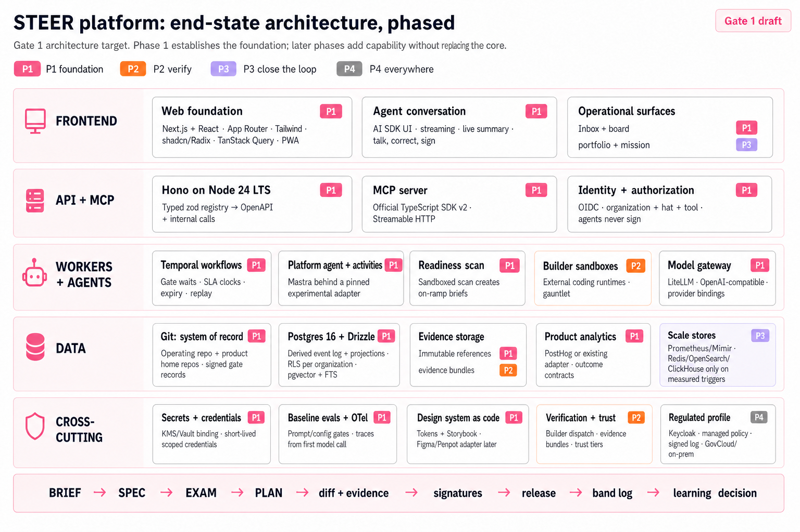

# 0001 Architecture: production foundation and phased end state

Item: `0001-flight-deck-foundation`
Status: **Gate 1 draft**
Revision: 2
Date: 2026-09-02

This architecture defines the production target for STEER. Phase 1 establishes
the foundations that would be expensive, unsafe, or disruptive to retrofit.
Later phases add capability behind declared seams; they do not replace the
core application, authority, tenancy, identity, or orchestration model.

The current Vite/React fixture application is a validated UX and domain
prototype. It is not the production Phase 1 walking skeleton and is not evidence
that the infrastructure described here exists.



## Acceptance principles

Every foundational choice must pass all five tests:

1. **One authority:** Git and code-host records remain authoritative; databases,
   workflow state, search indexes, and analytics are rebuildable projections.
2. **Tenant-safe from the first table:** identity, authorization, storage,
   evidence, memory, budgets, and execution are organization-scoped.
3. **Agent-operable from the first action:** the UI, platform agent, and external
   agents use the same typed tools and authorization rules.
4. **Portable by contract:** vendor products bind to seams. Domain code imports
   contracts, not vendor SDK objects.
5. **Proved end to end:** the Phase 1 walking skeleton must pass before the
   architecture is described as implemented.

“No switch later” means the foundational boundaries, data authority, package
topology, identity model, and contracts remain stable. Providers may still be
replaced behind those contracts, and experimental libraries must be isolated so
their replacement does not become a platform migration.

## Domain and repository topology

Organization → Portfolio → Product → Pod, with an organization-level specialist
pool. Humans and registered agents receive explicit hats and scoped permissions.
A pod runs the STEER loop; a product owns its interfaces, shared libraries, and
home repository; a portfolio signs mission briefs; the organization declares
identity, policy, budgets, and inherited defaults.

Each organization has one operating repository and any number of product
repositories. Every product names one home repository for item chains. The
operating repository holds `ORG.md`, portfolio/product/pod declarations,
policies, the kit, Stack Packs, and cross-product contracts. Product repositories
hold code and their authoritative item chains.

## Technology baseline

| Layer | Phase 1 foundation | Later additions |
|---|---|---|
| Workspace | pnpm + Turborepo; strict TypeScript | changesets and additional product packages |
| Web | Next.js App Router + React; Tailwind; shadcn/ui on Radix; TanStack Query; responsive PWA | portfolio and mission views in Phase 3 |
| Conversation | AI SDK UI streaming with a rendered operating summary beside the conversation | voice input and additional channels |
| API | Hono on Node 24 LTS; zod tool registry; generated OpenAPI | additional external adapters |
| MCP | official TypeScript SDK v2; Streamable HTTP for remote clients; stdio only for local clients | second code-host and additional agent hosts |
| Orchestration | Temporal TypeScript workflows for waits, SLAs, expiry, and recovery | automated Observe/Learn workflows |
| Platform agents | Mastra behind a version-pinned runtime adapter | additional runtimes if evidence warrants |
| Model access | self-hostable LiteLLM OpenAI-compatible gateway | provider additions through configuration |
| Data | Postgres 16+, Drizzle migrations, organization RLS, pgvector, and full-text search | triggered Redis, OpenSearch, and ClickHouse |
| Evidence | S3-compatible immutable objects referenced by content hash from Git | assembled evidence bundles |
| Product analytics | PostHog or an existing customer system behind the analytics seam | richer outcome and portfolio analysis |
| Identity | OIDC with normalized organization and hat claims; agent service identities | regulated Keycloak binding |
| Observability | OpenTelemetry from the first API, workflow, and model call | Langfuse/Grafana profile bindings and trust analytics |
| Testing | Vitest, Playwright, axe-core, contract tests, and manual Gate 3 accessibility evidence | full gauntlet and trust-tier evaluation |
| Delivery | package-level containers and Docker Compose for local integration | Helm/Terraform for regulated deployment |

LiteLLM is a separate gateway service and is therefore not constrained by the
TypeScript-only rule for STEER application code. Its interface is the
OpenAI-compatible model seam.

## Monorepo shape

```text
apps/
  web/            Next.js human surfaces and agent conversation
  api/            Hono API, webhooks, OpenAPI, and MCP transport
  worker/         Temporal workers and projection consumers
packages/
  domain/         Pure STEER entities, policies, and state transitions
  tool-registry/  One zod registry for UI, internal, OpenAPI, and MCP calls
  agents/         Role configurations and the version-pinned runtime adapter
  adapters/       Code host, CI, identity, model, evidence, analytics, sandbox,
                  notification, release-rails, and design-asset bindings
  data/           Drizzle schema, migrations, RLS policy, and projections
  ui/             Design tokens and accessible shared components
  kit/            Versioned STEER adoption kit and Learn corpus
  testkit/        Contract fixtures, replay harnesses, and architecture exam
```

The domain and tool-registry packages may not import a vendor SDK. Enforcement
belongs in dependency-boundary tests and the repository workflow.

## Architecture decisions

### ADR-01 — TypeScript application boundary

STEER application code uses strict TypeScript end to end. Python is permitted
only in isolated evaluation or analysis workers, and non-TypeScript products
such as LiteLLM remain separate services behind a typed seam.

### ADR-02 — Git is the sole system of record

Artifacts live under `items/NNNN-slug/` as versioned Markdown and structured
records. The first code-host binding is a GitHub App; the regulated binding is
self-hosted GitLab. The adapter supports one operating repository plus multiple
product repositories without assuming one repository per organization.

A gate decision is authoritative only when a revision-bound signature record is
written to the product home repository or an equivalently durable code-host
review record identified by the adapter. Postgres and the hash-chained audit log
mirror that decision; neither may create or repair an approval independently.

Writes use an idempotency key and complete against the code host first. Webhooks
and reconciliation project the resulting revision into Postgres, which avoids a
false distributed transaction between Git and the database.

### ADR-03 — Postgres for derived state

Postgres 16+ holds the append-only ingestion log, rebuildable Flight Board,
decision inbox, intent backlog, operational threads, pgvector memory, and
full-text search. Drizzle owns schema and migrations. No private status field is
authoritative. Destroy-and-replay must reproduce the same read model.

### ADR-04 — Temporal for durable orchestration

Each item uses a deterministic workflow identity derived from organization,
home repository, and item identifier. Temporal owns timers and execution
progress, not business truth. A reconciler can recreate or repair workflow
execution from the Git chain after a loss. Postgres `LISTEN/NOTIFY` is only a
low-latency hint; durable consumption always resumes from an event cursor.

### ADR-05 — Platform agents and external Builders

Mastra runs the platform agent and STEER role activities behind a runtime
adapter. Its Temporal integration is version-pinned and treated as experimental
until the walking skeleton proves restart, retry, upgrade, and replay behavior.
The adapter must allow direct Temporal activities or another agent runtime
without changing domain or workflow contracts.

Builders remain external coding runtimes. Phase 1 records their diffs and
evidence by reference; Phase 2 dispatches them into sandboxes.

### ADR-06 — Model gateway

Every model call goes through a self-hostable LiteLLM OpenAI-compatible endpoint.
Models, fallbacks, keys, spend, and per-pod budgets are configuration. A model
change requires a pinned configuration revision and green eval run, never a
domain-code change.

### ADR-07 — One tools-first API

One zod registry defines commands and queries. The registry generates OpenAPI,
MCP tools, and internal bindings; the web UI calls the same API. The remote MCP
transport is Streamable HTTP. The platform agent holds the same tools under a
scoped service identity.

`sign_gate` accepts only a verified human subject and active hat. Agent service
identities can prepare, route, and explain a decision but can never sign it.

### ADR-08 — Three memory tiers, files win

Tier 1 is Git canon and versioned context. Tier 2 is the exact item chain and
thread. Tier 3 is derived semantic/episodic retrieval in Postgres. Anything worth
retaining as organizational truth must be promoted to a governed file. Graph
memory remains a Phase 4 option triggered by evidence, not an assumed service.

### ADR-09 — Identity, tenancy, and signatures

OIDC tokens normalize to stable subject, organization, hats, and specialties.
The platform does not require one identity-provider realm per customer; profile
adapters map issuer-specific claims into the same internal authorization model.
Agents use revocable service identities issued by the Org Admin.

Every signature binds organization, subject, active hat, gate, sequence,
artifact revision, session identifier, decision, and timestamp. Commercial and
regulated distinct-signer rules are evaluated before the Git record is written.

### ADR-10 — Evals and observability start in Phase 1

Baseline prompt, tool-grant, model-pin, guardrail, and adapter contract evals run
in CI from the first platform-agent change. OpenTelemetry covers API requests,
tool calls, workflows, model calls, and projection lag from the first walking
skeleton. Phase 2 adds the complete gauntlet and trust-tier movement.

### ADR-11 — Execution sandboxes

The Phase 1 readiness scan runs in an ephemeral sandbox with scoped credentials.
Phase 2 adds sandboxed Builder dispatch and gauntlet execution. No external
Builder receives platform-host credentials or executes in the API/worker host.

### ADR-12 — Immutable evidence storage

Large logs, screenshots, test output, and traces live in tenant-scoped,
S3-compatible object storage. Git stores the content hash, media type, size,
producer, item revision, and storage reference. A referenced object is immutable;
Phase 2 assembles signed evidence bundles from these references.

### ADR-13 — Metrics and control bands

Product analytics enters in Phase 1 because outcome contracts cannot be proved
without it. Phase 3 adds Prometheus/Mimir control-band evaluation and automated
breach-to-brief. Band definitions remain versioned in Git.

### ADR-14 — Notification adapter

External notifications enter in Phase 3. Slack, Teams, email, and signed-log
bindings carry links and identity metadata, never artifact content. The decision
inbox remains authoritative for attention state.

### ADR-15 — Secrets and credentials start in Phase 1

Phase 1 production bindings require a secret-manager/KMS seam, encrypted service
configuration, and short-lived scoped credentials for the GitHub App, model
gateway, evidence store, and readiness sandbox. The regulated profile binds the
same interface to Vault or an approved cloud KMS.

### ADR-16 — Release rails

Feature flags and canary routing are external systems behind an OpenFeature-
compatible release seam. STEER records the signed release plan and observes
rollout state; it never becomes the production traffic router.

### ADR-17 — Phase 1 walking-skeleton exam

The walking skeleton is the **Phase 1 exit exam**, not a prerequisite that runs
before Phase 1. It must prove the integrated foundation:

1. Interview a natural-language intent and render the draft.
2. Commit the artifact through the GitHub adapter under the originator identity.
3. Project it into the correct backlog, board, and decision inbox.
4. Record a human signature bound to identity, hat, sequence, and revision.
5. Wait in Temporal, restart the worker, and resume the same item.
6. Call a model through LiteLLM and swap the model by configuration only.
7. Invoke one tool through MCP Streamable HTTP and the same authorization path
   used by the UI.
8. Run the readiness scan in a sandbox and create an on-ramp brief.
9. Store evidence, commit its content-hash reference, and retrieve it tenant-safely.
10. Create organization, portfolio, product, pod, hats, agent, Stack Pack, and
    repository topology through the platform-agent conversation and one human
    confirmation.
11. Reject cross-tenant reads at the API, database, search, evidence, model-key,
    and workflow boundaries.
12. Refuse same-session Gate 3 when the second-look rule applies, then accept a
    valid new-session decision.
13. Destroy Postgres projections and rebuild an identical user-visible state.

The Phase 1 architecture is not complete until this exam passes and one pilot
pod completes ten real items with production evidence kept distinct from test
fixtures.

### ADR-18 — Tenant isolation by construction

Every tenant-owned table carries `organization_id`. RLS is enabled from the
first migration; request handling sets organization context transaction-locally
so pooled connections cannot leak state. Database, pgvector, evidence, gateway
keys, sandboxes, workflow IDs, caches, and logs receive negative cross-tenant
tests in the architecture exam.

### ADR-19 — Stack Packs and runtime registry

A Stack Pack selects runtime adapters, language guardrails, exam templates,
release configuration, readiness checks, and starter context. Packs inherit
organization → product → pod and change only through eval-gated commits.

### ADR-20 — Platform agent enters in Phase 1

Onboarding is agent-run from the first production slice. The platform agent acts
only through registered tools, shows the live proposed summary beside the
conversation, requires human confirmation before structural writes, and never
signs. Every action remains available manually through the same API.

### ADR-21 — Readiness and personal capacity are projections

The readiness scan uses the selected Stack Pack and creates draft on-ramp briefs
through the standard intake route. Personal WIP across pods and hats, greenfield
measurement, and pre-mission unscored fit are rebuildable projections.

### ADR-22 — Application and delivery stack

The technology baseline and monorepo shape above are the Phase 1 production
foundation. Local integration uses Docker Compose for Postgres, Temporal,
LiteLLM, an OIDC development provider, and S3-compatible storage. Production
uses package-level containers. The regulated profile adds Helm, Terraform,
GovCloud/on-prem bindings, and a managed policy layer without changing the
application contracts.

### ADR-23 — Postgres first; scale stores need evidence

Use Postgres full-text plus pgvector for hybrid search. Redis, OpenSearch, and
ClickHouse enter only when explicit latency, fan-out, faceting, or aggregation
thresholds fail. They are disposable indexes or analytical projections, never
new authority stores.

### ADR-24 — Product analytics enters in Phase 1

The analytics contract and one working binding are required for the Phase 1
pilot. PostHog is the default self-hostable binding; an existing customer system
may implement the same contract. The measurable-today state resolves against
the binding and telemetry registry; greenfield remains distinct until data flows.

### ADR-25 — Design system as code enters in Phase 1

Design tokens and the accessible component library enter with the web
foundation. Storybook is the living catalog and component accessibility surface.
Figma and Penpot remain design-asset bindings. Mocks and prototypes are evidence
referenced by hash; Product Designer judgment compares the shipped experience
with the signed design evidence.

### ADR-26 — Supporting services

Voice input routes through the model gateway. Email and collaboration tools bind
to the notification seam. The product remains a responsive PWA rather than a
native mobile application. Git replication, Postgres point-in-time recovery,
versioned object storage, and destroy-and-rebuild form the recovery strategy.

### ADR-27 — Dependency and upgrade governance

The implementation records a lockfile, runtime versions, container digests,
database extensions, MCP protocol mode, migration compatibility, and adapter
contract version in a machine-readable stack lock. Automated dependency updates
may propose changes but cannot merge a foundational upgrade without the
architecture contract suite, migration rehearsal, and eval gate passing.

Experimental dependencies are acceptable only behind an owned interface, with a
tested fallback path and no experimental data format in the domain contract.

## Phase plan

| Phase | Outcome | Capability added |
|---|---|---|
| 0 · Kit | STEER can run manually from files | canon, templates, policy, guardrails, bands, Stack Pack v0, CI examples |
| 1 · Foundation | Humans and agents operate one tenant-safe, durable system | production monorepo; web/API/MCP; GitHub; Postgres/RLS; OIDC; Temporal; platform agent; LiteLLM; evidence references; product analytics; readiness sandbox; secrets; baseline evals/OTel; design system |
| 2 · Verify | STEER runs Engineer and Evaluate | sandboxed Builders, gauntlet, signed evidence bundles, trust ledger, full Stack Packs, advanced evals |
| 3 · Close the loop | Observe and Learn become operational | control bands, breach-to-brief, notifications, portfolio/mission views, capacity projections, triggered scale stores |
| 4 · Everywhere | Regulated and expanded profiles are certified | Keycloak/self-hosted bindings, managed policy, signed log, GovCloud/on-prem, GitLab, optional graph memory, internationalization |

Each phase inherits the Phase 1 authority, package, tenant, identity, and tool
contracts. No phase introduces a second source of truth or a parallel action API.

## Phase 1 non-goals

Phase 1 does not dispatch external Builders, run the full gauntlet, move trust
tiers, automate production control bands, or send external notifications. It
does establish the seams and evidence paths those capabilities will use.

## Profile bindings

| Seam | Commercial | Regulated |
|---|---|---|
| Code host | GitHub App | self-hosted GitLab |
| Models | providers through LiteLLM | Bedrock GovCloud, Azure Government, or on-prem vLLM through LiteLLM |
| Orchestration | Temporal Cloud or self-hosted | self-hosted Temporal |
| Identity | WorkOS/Auth0 or enterprise OIDC | Keycloak or agency OIDC |
| Evidence | managed S3-compatible store | MinIO or agency-approved object storage |
| Analytics | PostHog or existing customer analytics | self-hosted PostHog or agency analytics |
| Observability | Langfuse/Grafana binding | self-hosted approved binding |
| Design assets | Figma | Penpot or approved repository |
| Hosting | containers on an approved cloud | Kubernetes in GovCloud or on-prem with managed policy |

## Risks and mitigations

- **Mastra Temporal adapter maturity:** the current integration is experimental.
  Pin it, contract-test it, and retain a direct Temporal activity fallback.
- **Dual-record ambiguity:** Git/code-host records are authoritative; database
  and signed-log records may mirror but never independently create approval.
- **Tenant leakage through pooled connections:** use transaction-local RLS
  context and negative tests at every storage/execution boundary.
- **Gateway and SDK churn:** pin images, packages, MCP protocol mode, and model
  versions; upgrade only through ADR-27.
- **Integration risk:** ADR-17 is the release gate. Component-level demos do not
  prove the platform.
- **Fixture confusion:** fixture results stay labeled as test evidence and never
  populate production baselines.

## Gate 1 decisions still owned by humans

1. Confirm GitHub App/API writes as the first code-host binding.
2. Choose the initial commercial OIDC binding while preserving the normalized
   claim contract.
3. Decide the legal form of regulated signatures and whether a signed-log mirror
   is required in the first regulated deployment.
4. Approve the default product-analytics binding and data-retention posture.
5. Approve the Phase 1 production deployment profile and cost envelope.

## Technology verification notes

- Mastra publishes a Temporal integration, but currently labels the package
  experimental; ADR-05 and ADR-27 isolate that risk.
- LiteLLM documents a self-hosted OpenAI-compatible proxy and remains a service
  binding rather than an application dependency.
- The official MCP TypeScript SDK v2 is the target. Remote MCP uses Streamable
  HTTP; legacy HTTP+SSE is not the production transport.
- Certification claims are procurement evidence, not architecture assumptions.
  Provider compliance status must be verified at selection time.
